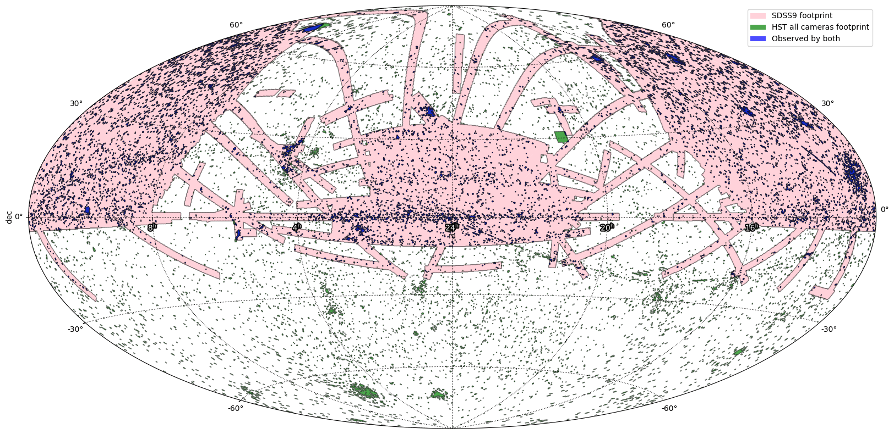

*****
MOCPy
*****
|PyPI version| |Build/Test status| |Notebook Binder| |Doc|

MOCPy is a Python library allowing easy creation and manipulation of MOCs (Multi-Order Coverage maps).   

MOC is an IVOA standard  enabling description of arbitrary sky regions.  
Based on the HEALPix sky tessellation, it maps regions on the sky
into hierarchically grouped predefined cells.

An experimental support for TMOC (temporal MOC) has been added since version 0.4.0.
It allows creation, parsing and comparison of TMOCs.

Space & Time coverages (STMOC) are an extension of MOC to add time information.
It is possible to get a TMOC by querying a STMOC with a MOC and/or get a MOC 
by querying a STMOC with a TMOC.

Please check the mocpy's `documentation <https://cds-astro.github.io/mocpy/>`__
for more details about installing MOCPy and using it.

For a command line tool, see the `moc-cli <https://github.com/cds-astro/cds-moc-rust/tree/main/crates/cli>`__. 

For more information about the MOCPy Rust core, see the `moc crate <https://crates.io/crates/moc>`__. 

   *Rendered with MOCpy!*

.. |PyPI version| image:: https://badge.fury.io/py/mocpy.svg
    :target: https://badge.fury.io/py/MOCPy

.. |Build/Test status| image:: https://github.com/cds-astro/mocpy/actions/workflows/test.yml/badge.svg
    :target: https://github.com/cds-astro/mocpy/actions/workflows/test.yml

.. |Notebook Binder| image:: http://mybinder.org/badge.svg
    :target: https://mybinder.org/v2/gh/cds-astro/mocpy/master

.. |Doc| image:: https://img.shields.io/badge/Documentation-link-green.svg
    :target: https://cds-astro.github.io/mocpy/

