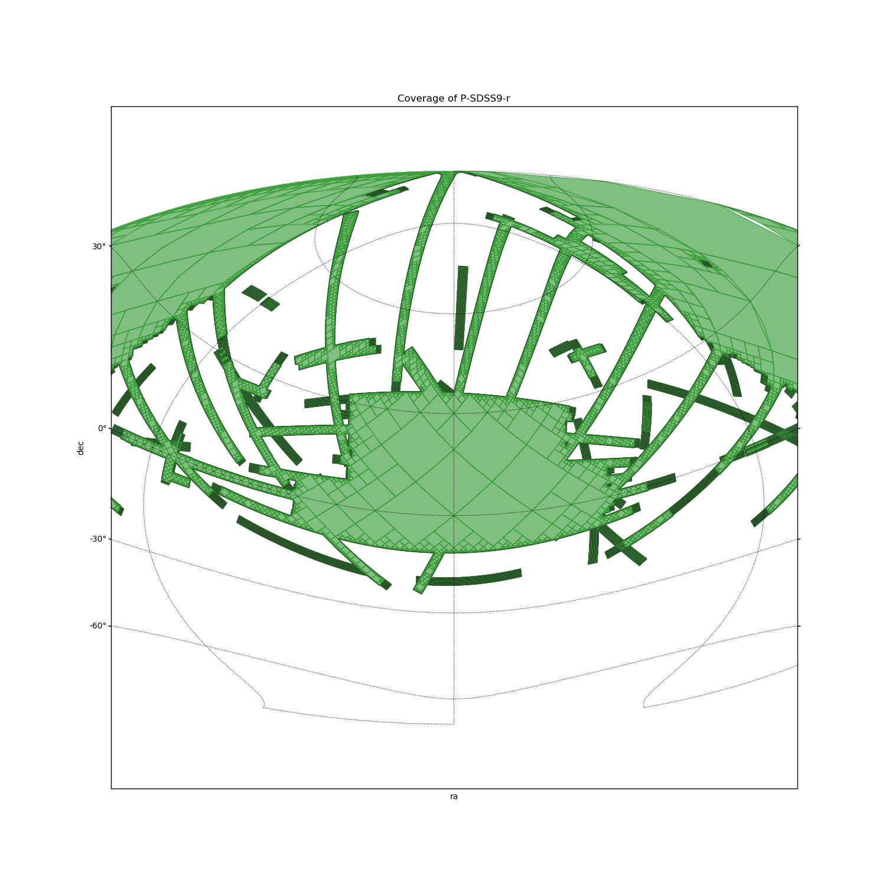

Examples
========

See the tutorial notebooks for examples: `view on github <https://github.com/cds-astro/mocpy/tree/master/notebooks>`__, `launch on binder <https://mybinder.org/v2/gh/cds-astro/mocpy/master>`__.

Loading and plotting a MOC
--------------------------

.. code-block:: python
    
    from mocpy import MOC, WCS
    from astropy.coordinates import Angle, SkyCoord
    import astropy.units as u
    # Load a MOC
    filename = '<repo_mocpy>/notebooks/demo-data/P-SDSS9-r.fits'
    moc = MOC.from_fits(filename)
    # Plot the MOC using matplotlib
    import matplotlib.pyplot as plt
    fig = plt.figure(111, figsize=(15, 15))
    # Define a WCS as a context
    with WCS(fig, 
            fov=200 * u.deg,
            center=SkyCoord(0, 20, unit='deg', frame='icrs'),
            coordsys="icrs",
            rotation=Angle(0, u.degree),
            projection="AIT") as wcs:
        ax = fig.add_subplot(1, 1, 1, projection=wcs)
        # Call fill with a matplotlib axe and the `~astropy.wcs.WCS` wcs object.
        moc.fill(ax=ax, wcs=wcs, alpha=0.5, fill=True, color="green")
        moc.border(ax=ax, wcs=wcs, alpha=0.5, color="black")
    plt.xlabel('ra')
    plt.ylabel('dec')
    plt.title('Coverage of P-SDSS9-r')
    plt.grid(color="black", linestyle="dotted")
    plt.show()

